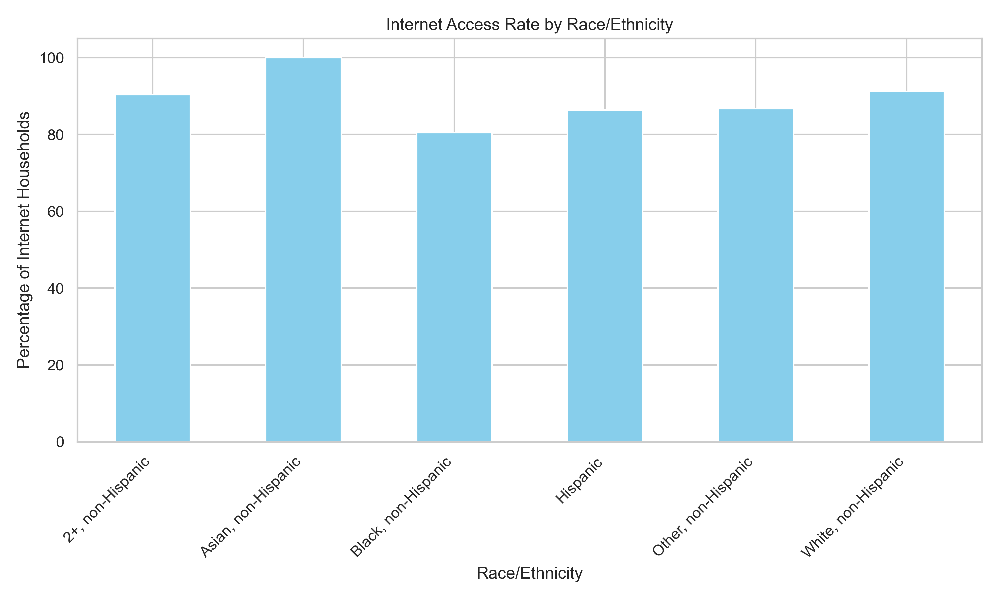
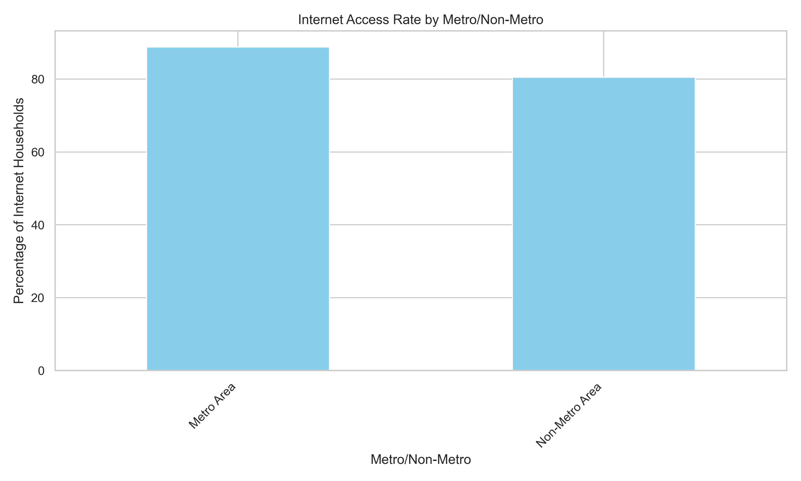
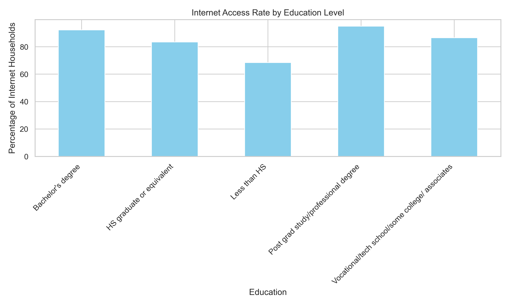
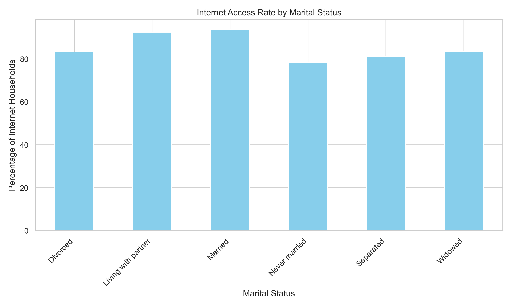
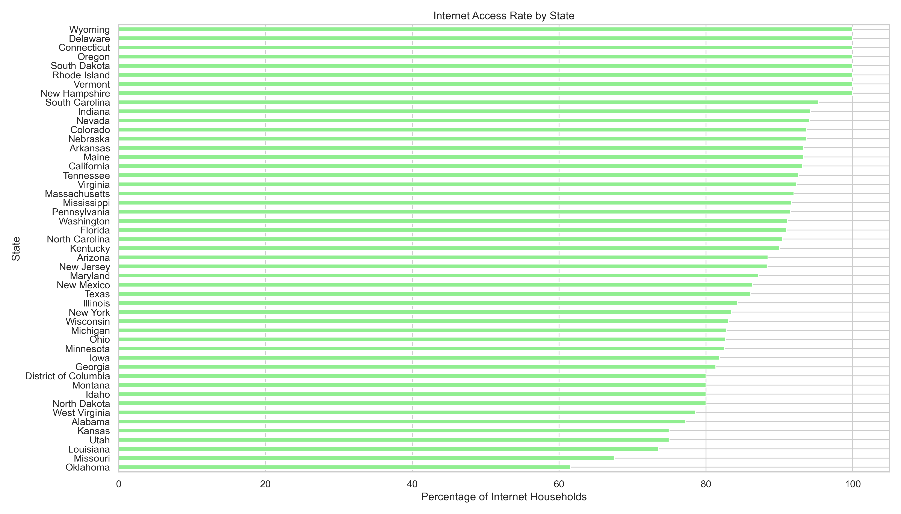
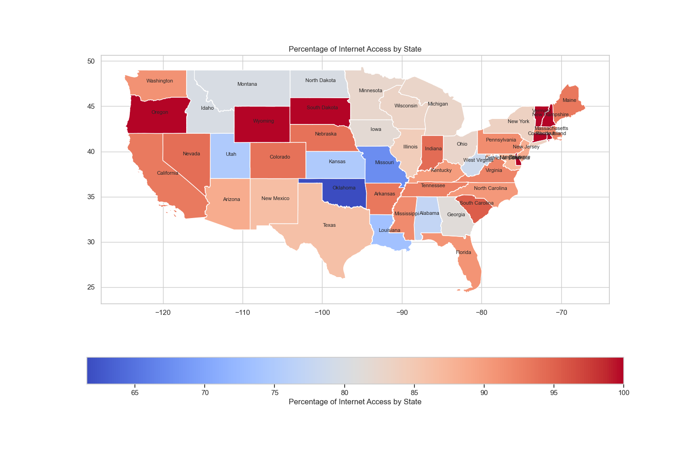

# CYPLAN255Project_Joy
## Exploring the Disparities in Internet Usage Among Older Adults
Leyi(Joy)Zhou, PhD Student, School of Social Weflare

### 1. Introduction
#### 1.1 Digital Divide among older adults 
Significant digital divides between younger and older generations have been exacerbated by the COVID-19 pandemic, leading to barriers in accessing information and services, as well as hindering social inclusion and engagement (Gallegos-Rejas et al., 2023; Seifert, 2020; Choudrie, Zamani & Obuekwe, 2022). The internet is an essential resource for health information, social connectivity, and financial management (Lepkowsky & Arndt, 2019). However, not all older adults have equal access to these digital benefits. The digital divide describes the unequal distribution of access, knowledge, and proficiency in using information and communication technologies, especially affecting disadvantaged communities (Dykgraaf et al., 2022). This disparity results in an inequitable divide between those who can leverage technology to their advantage and those who cannot (van Dijk, 2005; Yu et al., 2016). Several factors contribute to the digital divide, including limited internet access and devices, a lack of Information Technology (IT) education, low digital literacy, personal beliefs about the value of technology, perceived efficacy in using specific devices, and concerns about cost, privacy protections, and usability (Choudrie, Zamani & Obuekwe, 2022; Peek et al., 2014). Van Dijk (1999) identifies four types of barriers that contribute to the digital divide: lack of interest (‘mental access’), lack of device or network connections (‘material access’), lack of digital skills (‘skills access’), and lack of usage opportunities (‘usage access’). This study will begin by exploring one of the primary factors causing the digital divide—internet access—since having the equipment is foundational for older adults to start using the internet and various technologies in their lives.

#### 1.2 Disparities in Internet Access
Preliminary data suggest there may be significant disparities in internet access among older adults, potentially leading to a digital divide within this demographic (Chang et al., 2015). Such a divide could exacerbate existing inequalities and limit the ability of some older adults to fully participate in increasingly digital societies (Hunsaker & Hargittai, 2018). Older adults with low income and education levels, those from racial minority groups, and individuals with disabilities are particularly affected by this digital divide (Choudrie, Zamani & Obuekwe, 2022; Seifert, 2022). The divide not only restricts material access, such as devices and connections, but also impacts mental access (interest), skills access (digital literacy), and usage access (opportunities for use) (van Dijk, 1999; Yu et al., 2016).
	
Several factors might contribute to disparities in internet access among older adults. For instance, older adults in metropolitan areas may have higher internet access rates than those in rural areas, due to better infrastructure and availability of services (Berner et al., 2015). Additionally, there might be racial disparities in internet access, with some racial groups having higher access rates than others (Hargittai et al., 2019). Economic factors also play a crucial role, as the cost of internet services and devices can be prohibitive for some older adults, limiting their ability to go online (Silver, 2014; Yu et al., 2016). This research aims to further explore whether geographical factors, such as which state people live in, correlate with internet access and how these geographical factors interact with demographic factors.
 
#### 1.3 Research Question
In the digital age, access to the internet has become a critical factor in determining the quality of life, influencing everything from social engagement to access to information and services. As such, disparities in internet access can significantly impact various demographics, particularly older adults. This research aims to delve into the question: Is there a disparity in internet access among older adults? By examining this issue, I hope to uncover patterns of inequality that may exist based on geographic location, socioeconomic status, race, or other factors.

### 2. Methodology
This study utilized data from the **2022 AARP Healthy Living Survey of Adults Age 50 and Older**, conducted by NORC at the University of Chicago. The dataset is publicly available and can be accessed via the AARP website under "AARP Datasets." Following data cleaning procedures, a total of 1,964 records were selected for analysis. The first part of the analysis includes basic descriptive statistics, such as tabulation and bar graphs, to describe the disparities in internet access among different demographic groups. The second part of the analysis explores the relationship between geographic location and demographic information to visualize whether older adults from different states with diverse demographic characteristics exhibit any differences in internet access.

#### 2.1 Variable
The primary outcome variable was the presence of internet access at home, categorized into two groups: "internet household" and "Non-internet household." The demographic variables used in this project are:
- Education ('educ5'): This variable has five values: Vocational/Tech School/Some College/Associate Degrees, Bachelor's Degrees, Postgraduate/Professional Degrees, High School Graduates or equivalents, and less than a High School education. The descriptive analysis, both tabulated and graphed, utilizes these five categories. When creating the interactive map, to reduce the number of layers, this variable was regrouped into two categories: **"Above HS"** which includes Vocational/Tech School/Some College/Associate Degrees, Bachelor's Degrees, and Postgraduate/Professional Degrees; and **"Equal or Under HS"** which includes High School Graduates or equivalents and those with less than a High School education.
- Marital Status ('marital'): This variable has six values: Married, Divorced, Never Married, Separated, Widowed, and Living with a Partner. The descriptive analysis, both tabulated and graphed, utilizes these six categories. When creating the interactive map, to reduce the number of layers, this variable was regrouped into two groups: **"Married"** includes those who are married; **"Non-Married"** includes all other statuses, such as Divorced, Never Married, Separated, Widowed, and Living with a Partner.
- Race ('racethni'): This variable has six values:  White Non-Hispanic, Black Non-Hispanic, Hispanic，Multiracial Non-Hispanic, Asian Non-Hispanic, and Other Non-Hispanic. The descriptive analysis, both tabulated and graphed, utilizes these five categories. When creating the interactive map, to reduce the number of layers, this variable maintains categories for **White Non-Hispanic**, **Black Non-Hispanic**, and **Hispanic**, while regrouping all other categories into **"Other Group"** (including Multiracial Non-Hispanic, Asian Non-Hispanic, and Other Non-Hispanic).
- Metropolitan Status ('Metro'): With two values indicating whether individuals live in a **Metro Area** or a **Non-Metro Area**.

#### 2.2 Geographical Focus
To optimize the scale for visualization, the analysis was confined to the contiguous United States, excluding Alaska and Hawaii. This focus resulted in the inclusion of 1,953 records. An interactive map was created using the **Folium** package to visualize the distribution of internet access among older adults across different states. This map integrates data from the AARP database with the TIGER/Line shapefiles of U.S. states, effectively representing geographic disparities in internet accessibility. In total, there are 32 different demographic groups derived from these variables (4 categories for Education x 2 for Marital Status x 2 for Race x 2 for Metropolitan Status).

### 3. Visualisation 

#### 3.1 Internet Access Rates Among Older Adults from Different Racial/Ethnic Groups

| racethni            |   Internet Household |   Non-internet household |
|:--------------------|---------------------:|-------------------------:|
| 2+, non-Hispanic    |              90.3226 |                  9.67742 |
| Asian, non-Hispanic |             100      |                  0       |
| Black, non-Hispanic |              80.4989 |                 19.5011  |
| Hispanic            |              86.3861 |                 13.6139  |
| Other, non-Hispanic |              86.6667 |                 13.3333  |
| White, non-Hispanic |              91.1877 |                  8.81226 |

The graph and accompanying table illustrate the rates of internet access among older adults across various racial and ethnic groups. It is clear from the data that there is significant variation in internet connectivity among these groups. Asian, non-Hispanic households boast the highest rate of internet access, with 100% connectivity, indicating complete coverage within this demographic. Following closely are the 2+ races, non-Hispanic, and White, non-Hispanic groups, with access rates of approximately 90.3% and 91.2% respectively. On the other hand, Black, non-Hispanic households have a notably lower connectivity rate, at about 80.5%, highlighting a digital divide that may hinder access to vital online resources for individuals within this group. Both Hispanic and Other, non-Hispanic categories have similar rates, around 86%, suggesting moderate levels of internet access. These variances in internet accessibility underscore the need for focused interventions aimed at closing these gaps and ensuring that all racial and ethnic groups have equitable access to digital technologies. Such efforts are crucial for enabling full participation in a digitally-driven society, ensuring that all older adults, regardless of race or ethnicity, can benefit from the resources available online.

#### 3.2 Internet Access Rates Among Older Adults from Metro Area and Non-Metro Area

| metro          |   Internet Household |   Non-internet household |
|:---------------|---------------------:|-------------------------:|
| Metro Area     |              88.8177 |                  11.1823 |
| Non-Metro Area |              80.5085 |                  19.4915 |

The graph and accompanying table present data on internet access rates among older adults, distinguishing between those living in metropolitan (Metro Area) and non-metropolitan (Non-Metro Area) regions. The visualization clearly shows that internet connectivity is higher in metropolitan areas, with approximately 88.8% of households connected, compared to 80.5% in non-metropolitan areas. This indicates a significant digital divide based on geographic location. The data reveals that non-metropolitan areas face a greater challenge in internet accessibility, with nearly 19.5% of households lacking internet access, compared to about 11.2% in metropolitan areas. This disparity highlights the need for targeted efforts to improve internet infrastructure and accessibility in rural and non-metropolitan areas, ensuring that all older adults, regardless of their geographical location, have equal opportunities to access digital resources and services. 

#### 3.3 Internet Access Rates Among Older Adults with different eductaion level

| educ5                                           |   Internet Household |   Non-internet household |
|:------------------------------------------------|---------------------:|-------------------------:|
| Bachelor's degree                               |              92.2865 |                  7.7135  |
| HS graduate or equivalent                       |              83.526  |                 16.474   |
| Less than HS                                    |              68.4211 |                 31.5789  |
| Post grad study/professional degree             |              95.0617 |                  4.93827 |
| Vocational/tech school/some college/ associates |              86.6114 |                 13.3886  |

The displayed graph and table showcase the correlation between educational level and internet access among older adults, revealing a significant digital divide. Individuals with higher educational levels, such as those holding postgraduate or professional degrees, exhibit the highest internet access rates at around 95.1%. This trend continues with those holding a bachelor's degree, where approximately 92.3% have internet access. In contrast, as educational levels decrease, so does internet accessibility. For instance, those with vocational, technical schooling, some college, or associate degrees have an 86.6% access rate. This figure drops further for high school graduates or equivalent, with 83.5% having internet access. The most pronounced gap is seen among those with less than a high school education, where only 68.4% have internet access. This disparity highlights a broader societal issue where lower educational attainment correlates with reduced digital connectivity, limiting access to essential online resources. This situation underscores the critical need for focused interventions such as digital literacy programs and affordable internet services, especially targeted at the lower education groups to ensure equitable access to digital opportunities.

#### 3.4 Internet Access Rates Among Older Adults from Different Racial/Ethnic Groups

| marital             |   Internet Household |   Non-internet household |
|:--------------------|---------------------:|-------------------------:|
| Divorced            |              83.2808 |                 16.7192  |
| Living with partner |              92.4528 |                  7.54717 |
| Married             |              93.654  |                  6.34596 |
| Never married       |              78.3051 |                 21.6949  |
| Separated           |              81.2865 |                 18.7135  |
| Widowed             |              83.5714 |                 16.4286  |

The graph detailing internet access rates by marital status among older adults reveals significant patterns, indicating that marital status profoundly affects digital connectivity. Married individuals and those living with a partner report the highest internet connectivity rates, at approximately 93.7% and 92.5% respectively. This suggests that shared economic resources and joint management of technology within households could enhance internet access, making it more sustainable. In contrast, those who have never married show the lowest connectivity, with only about 78.3% accessing the internet. This group may face unique challenges like single-income constraints or a lesser emphasis on digital connectivity, which is often mitigated by the presence of additional household members. Divorced and widowed individuals maintain relatively high access rates, around 83%, possibly due to their previous experiences with technology in a partnered setting which helps them keep their digital connections even after changes in marital status. Those classified as separated have slightly lower access rates, potentially reflecting the instability or transitional nature of their living situations that may disrupt consistent internet service. These observations underscore that marital status is not merely a demographic marker but also a critical factor influencing digital access. The discrepancies in internet access among these groups highlight the need for tailored digital inclusion strategies that account for varied social structures and personal circumstances. Developing interventions that address the specific needs and challenges faced by each marital status group could help close the digital divide and empower all older adults to participate more fully in the digital world.

#### 3.5 Internet Access Rates Among Older Adults from Different State

These two visualizations provided illustrate the internet access rates across the United States using the same dataset but present the information in distinct formats that cater to different analytical needs or preferences.
- Horizontal Bar Graph: The first graph is a horizontal bar chart that ranks states by the percentage of households with internet access. This visualization is particularly effective for quickly identifying which states have the highest and lowest connectivity. For instance, states like Wyoming and Delaware appear at the top, indicating higher internet access rates, while states like Oklahoma and Louisiana appear at the bottom, suggesting lower rates. The simplicity of the bar chart makes it easy to compare states directly and observe the extent of variation across the country.
- Heat Map: The second visualization is a heat map of the United States colored according to the percentage of internet access in each state. This geographic representation allows for an immediate visual grasp of regional patterns and anomalies in internet connectivity. For example, one can observe that states in the Northeast generally show higher internet connectivity, which could correlate with urban density and infrastructure availability. Conversely, some states in the South and Southwest show lower connectivity, potentially highlighting regional disparities in infrastructure or economic factors that influence internet access.
- Comparative Analysis: Together, these graphs provide a comprehensive overview of internet access variability across the U.S. While the bar graph offers a straightforward, ranked comparison of states, the heat map provides a contextual and spatial understanding of how internet access is distributed geographically. This dual approach is valuable for policymakers, researchers, and stakeholders looking to address digital divides, as it highlights both the broad national trends and the specific regional needs. The combined use of these visual tools can lead to more informed decisions about where to focus efforts and resources to improve internet accessibility effectively.

### Interactive map
Using **Folium** package to visualize the distribution of internet access among older adults across different states the interactive map integrates data from the AARP database with the TIGER/Line shapefiles of U.S. states, effectively representing geographic disparities in internet accessibility. In total, there are 32 different demographic groups derived from these variables (4 categories for Education x 2 for Marital Status x 2 for Race x 2 for Metropolitan Status).

[View Basemap.html](Basemap.html)

[View US_demographic_internet_access_map.html](US_demographic_internet_access_map.html)

### Conclusion
  In this preliminary study, I aim to map out internet access rates among older adults across different states and analyze access rates among various racial and socioeconomic groups. This will provide a comprehensive picture of the digital landscape faced by older adults in the United States. Understanding where disparities in internet access exist is crucial for developing targeted interventions to bridge these gaps.
	The growing reliance on digital solutions for essential services and social engagement underscores the need for targeted interventions to bridge the digital divide for older adults. By increasing digital literacy training, ensuring affordable access to technology, and customizing services to meet diverse needs, societies can enhance the well-being and inclusivity of their aging populations. Here are some proposed solutions for future intervention to improve internet access and solve digital gap:
- Digital Literacy Programs: Implement community-based training programs that cater specifically to older adults, teaching them how to use the internet safely and effectively. These programs can be offered through local libraries, senior centers, and community colleges.
- Affordable Technology Access: Work with technology companies and service providers to offer discounted rates for internet services and devices to low-income older adults. Initiatives like providing refurbished devices can also help mitigate costs.
- Customized User Interfaces: Develop more user-friendly interfaces tailored to the needs of older adults. This could involve larger text options, simplified navigation, and voice-activated controls to help those with physical limitations.
- Community Tech Support: Establish local tech support hubs where older adults can receive help with their devices. This support can be a part of existing local services or a new volunteer-driven effort.
- Policy Advocacy: Advocate for policies that require internet service providers to offer equitable services across all demographics and regions. This includes pushing for - expanded broadband infrastructure to rural and underserved areas.
- Inclusive Design Principles: Encourage software developers and web designers to follow inclusive design principles that accommodate the aging population's needs, such as compatibility with assistive technologies and adaptable user interfaces.
  
In future studies, I would like to continue addressing the issue of the digital divide among the older population. By investigating existing disparities in internet access and designing interventions to ensure equitable internet access, we can help older adults stay connected, informed, and engaged. This not only improves their quality of life but also enhances their participation in the digital world, fostering a more inclusive society.

### References:
Berner, J., Rennemark, M., Jogréus, C., Anderberg, P., Sköldunger, A., Wahlberg, M., ... & Berglund, J. (2015). Factors influencing Internet usage in older adults (65 years and above) living in rural and urban Sweden. Health informatics journal, 21(3), 237-249.

Chang, J., McAllister, C., & McCaslin, R. (2015). Correlates of, and barriers to, Internet use among older adults. Journal of gerontological social work, 58(1), 66-85.

Choudrie, J., Zamani, E., & Obuekwe, C. (2022). Bridging the digital divide in ethnic minority older adults: an organisational qualitative study. Information Systems Frontiers, 24(4), 1355-1375.

Dykgraaf, S. H., Desborough, J., Sturgiss, E., Parkinson, A., Dut, G. M., & Kidd, M. (2022). Older people, the digital divide and use of telehealth during the COVID-19 pandemic. Australian Journal of General Practice, 51(9), 721-724.

Gallegos-Rejas, V. M., Thomas, E. E., Kelly, J. T., & Smith, A. C. (2023). A multi-stakeholder approach is needed to reduce the digital divide and encourage equitable access to telehealth. Journal of Telemedicine and Telecare, 29(1), 73-78.

Hargittai, E., Piper, A. M., & Morris, M. R. (2019). From internet access to internet skills: digital inequality among older adults. Universal Access in the Information Society, 18, 881-890.

Hunsaker, A., & Hargittai, E. (2018). A review of Internet use among older adults. New media & society, 20(10), 3937-3954.

Lepkowsky, C. M., & Arndt, S. (2019). The Internet: Barrier to health care for older adults?. Practice Innovations, 4(2), 124.

Peek, S. T., Wouters, E. J., Van Hoof, J., Luijkx, K. G., Boeije, H. R., & Vrijhoef, H. J. (2014). Factors influencing acceptance of technology for aging in place: a systematic review. International journal of medical informatics, 83(4), 235-248.

Seifert, A. (2020). The digital exclusion of older adults during the COVID-19 pandemic. Journal of gerontological social work, 63(6-7), 674-676.

Silver, M. P. (2014). Socio-economic status over the lifecourse and internet use in older adulthood. Ageing & Society, 34(6), 1019-1034.

van Dijk, J. (2005). The deepening divide: Inequality in the information society. Thousand Oaks, 
CA: Sage.

Yu, R. P., Ellison, N. B., McCammon, R. J., & Langa, K. M. (2016). Mapping the two levels of digital divide: Internet access and social network site adoption among older adults in the USA. Information, Communication & Society, 19(10), 1445-1464.
