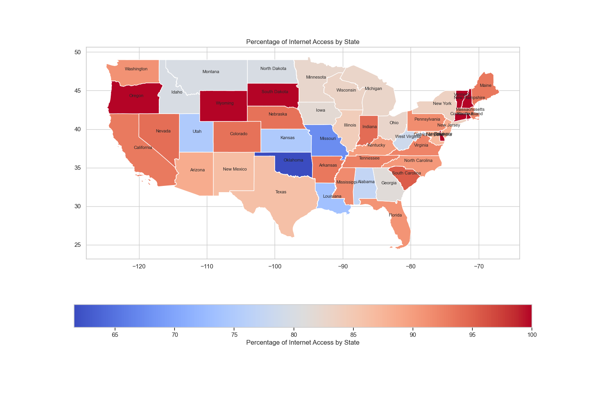

# CYPLAN255Project_Joy
## Exploring the Disparities in Internet Usage Among Older Adults
Leyi(Joy)Zhou, PhD Student, School of Social Weflare

### Introduction
While the development of technology and the internet has brought convenience to our lives, the older generation is often left behind. The disparities in accessing information and resources among older adults are deepened by differences in racial background, socioeconomic status, education, and so forth. This project will focus on exploring the disparities in internet usage among older adults.

### Research Question
In the digital age, access to the internet has become a critical factor in determining the quality of life, influencing everything from social engagement to access to information and services. As such, disparities in internet access can significantly impact various demographics, particularly older adults. This research aims to delve into the question: **Is there a disparity in internet access among older adults?** By examining this issue, I hope to uncover patterns of inequality that may exist based on geographic location, socioeconomic status, race, or other factors.

The internet has proven to be a vital resource for health information, social connectivity, and even financial management. However, not all older adults have the same level of access to these digital benefits. Preliminary data suggests that there might be significant disparities in internet access among older adults, potentially leading to a digital divide within this demographic. Such a divide could exacerbate existing inequalities and limit the ability of some older adults to fully participate in increasingly digital societies.

Several factors might contribute to disparities in internet access among older adults. For instance, older adults in metropolitan areas may have higher internet access rates than those in rural areas due to better infrastructure and availability of services. Moreover, there might be racial disparities in internet access, with some racial groups having higher access rates than others. Economic factors also play a crucial role, as the cost of internet services and devices can be prohibitive for some older adults, limiting their ability to go online.

This research will investigate these disparities. By mapping out internet access rates among older adults across different states and analyzing access rates among different racial and socioeconomic groups, I aim to paint a comprehensive picture of the digital landscape faced by older adults in the United States. Understanding whether and where disparities in internet access among older adults exist is crucial for developing targeted interventions to bridge the digital divide. By ensuring equitable internet access, we can help older adults stay connected, informed, and engaged, ultimately improving their quality of life and participation in the digital world.

### Methodology
This study utilized data from the **2022 AARP Healthy Living Survey of Adults Age 50 and Older** conducted by NORC at the University of Chicago. The dataset is publicly available and accessible via the AARP website under "AARP Datasets." Following data cleaning procedures, a total of 1,964 records were selected for analysis.
#### Variable
The primary outcome variable was the presence of internet access at home, categorized into two groups: "internet household" and "Non-internet household." The demographic variables used in this project are:
- Education ('educ5'): This variable has five values and was regrouped into two categories: "Above HS" includes Vocational/Tech School, Some College, Associate Degrees, Bachelor's Degrees, and Postgraduate/Professional Degrees; "Equal or Under HS" includes High School Graduates or equivalents and those with less than a High School education.
- Marital Status ('marital'): Initially with six values, this was simplified into two groups: "Married" includes those who are married; "Non-Married" includes all other statuses, such as Divorced, Never Married, Separated, Widowed, and Living with a Partner.
- Race ('racethni'): With six initial values, this variable maintains categories for White Non-Hispanic, Black Non-Hispanic, and Hispanic groups, while regrouping all other categories into "Other Group" (including Multiracial Non-Hispanic, Asian Non-Hispanic, and Other Non-Hispanic).
- Metropolitan Status ('Metro'): With two values indicating whether individuals live in a Metro Area or a non-metro area.
In total, there are 32 different demographic groups derived from these variables (4 categories for Education x 2 for Marital Status x 2 for Race x 2 for Metropolitan Status).
#### Geographical Focus: 
To optimize the scale for visualization, the analysis was confined to the contiguous United States, excluding Alaska and Hawaii. This focus resulted in the inclusion of 1,953 records.
#### Mapping: 
An interactive map was created using the Folium package to visualize the distribution of internet access among older adults across different states. This map integrates data from the AARP database with the TIGER/Line shapefiles of U.S. states, effectively representing geographic disparities in internet accessibility.

### Visualisation 

[View Basemap.html](Basemap.html)

[View US_demographic_internet_access_map.html](US_demographic_internet_access_map.html)

### References:
Berner, J., Rennemark, M., Jogréus, C., Anderberg, P., Sköldunger, A., Wahlberg, M., ... & Berglund, J. (2015). Factors influencing Internet usage in older adults (65 years and above) living in rural and urban Sweden. Health informatics journal, 21(3), 237-249.

Chang, J., McAllister, C., & McCaslin, R. (2015). Correlates of, and barriers to, Internet use among older adults. Journal of gerontological social work, 58(1), 66-85.

Choudrie, J., Zamani, E., & Obuekwe, C. (2022). Bridging the digital divide in ethnic minority older adults: an organisational qualitative study. Information Systems Frontiers, 24(4), 1355-1375.

Dykgraaf, S. H., Desborough, J., Sturgiss, E., Parkinson, A., Dut, G. M., & Kidd, M. (2022). Older people, the digital divide and use of telehealth during the COVID-19 pandemic. Australian Journal of General Practice, 51(9), 721-724.

Gallegos-Rejas, V. M., Thomas, E. E., Kelly, J. T., & Smith, A. C. (2023). A multi-stakeholder approach is needed to reduce the digital divide and encourage equitable access to telehealth. Journal of Telemedicine and Telecare, 29(1), 73-78.

Hargittai, E., Piper, A. M., & Morris, M. R. (2019). From internet access to internet skills: digital inequality among older adults. Universal Access in the Information Society, 18, 881-890.

Hunsaker, A., & Hargittai, E. (2018). A review of Internet use among older adults. New media & society, 20(10), 3937-3954.

Lepkowsky, C. M., & Arndt, S. (2019). The Internet: Barrier to health care for older adults?. Practice Innovations, 4(2), 124.

Peek, S. T., Wouters, E. J., Van Hoof, J., Luijkx, K. G., Boeije, H. R., & Vrijhoef, H. J. (2014). Factors influencing acceptance of technology for aging in place: a systematic review. International journal of medical informatics, 83(4), 235-248.

Seifert, A. (2020). The digital exclusion of older adults during the COVID-19 pandemic. Journal of gerontological social work, 63(6-7), 674-676.

Silver, M. P. (2014). Socio-economic status over the lifecourse and internet use in older adulthood. Ageing & Society, 34(6), 1019-1034.

van Dijk, J. (2005). The deepening divide: Inequality in the information society. Thousand Oaks, 
CA: Sage.

Yu, R. P., Ellison, N. B., McCammon, R. J., & Langa, K. M. (2016). Mapping the two levels of digital divide: Internet access and social network site adoption among older adults in the USA. Information, Communication & Society, 19(10), 1445-1464.
